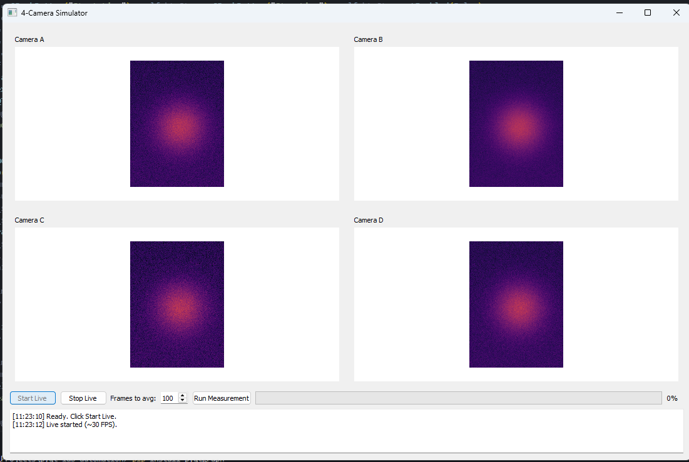

# PyQt Lab Automation Demo

Simulator of a 4-camera lab setup built with **PyQt5** and **PyQtGraph**.  
Includes live video feeds, measurement averaging, and simple SNR calculations.

## Preview



## Features
- 4 live simulated camera feeds
- Start/Stop controls
- Run measurement with averaging (user-selectable)
- Logs with mean / noise / SNR per camera
- Cross-platform (tested on Windows + macOS)

## Quick Start

### Windows
```powershell
git clone https://github.com/taryb/pyqt-lab-automation.git
cd pyqt-lab-automation
python -m venv .venv
.\.venv\Scripts\Activate.ps1
pip install -r requirements.txt
python .\src\app.py
